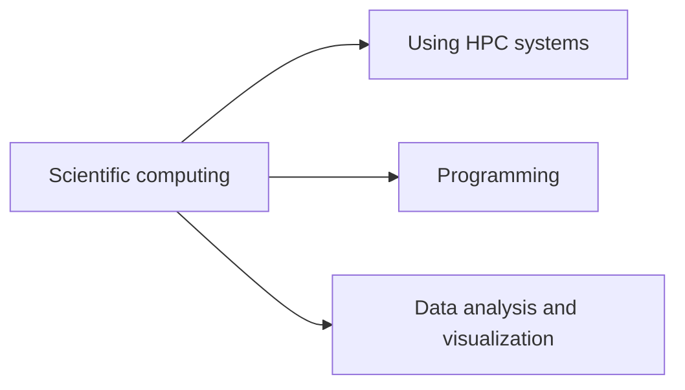

# Computational skills

```mermaid
graph LR
    Scientific_computing[Scientific computing] --> Using_HPC_systems[Using HPC systems]
    Scientific_computing --> Programming[Programming]
    Scientific_computing --> Data_analysis_and_visualization[Data analysis and visualization]
    click Using_HPC_systems "using_hpc_systems.md" "Using HPC systems"
    click Programming "programming.md" "Programming"
    click Data_analysis_and_visualization "data_analysis_and_visualization.md" "Data analysis and visualization"
``` 
