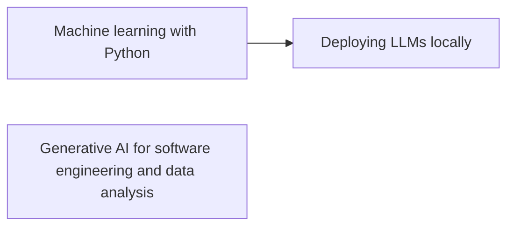

# AI and machine learning

AI and machine learning are increasingly used in many scientific domains.  These trainings
will help you learn how to use this in your own work.

```mermaid
graph LR
  Machine_learning_with_Python[Machine learning with Python] --> Deploying_LLMs_locally[Deploying LLMs locally]
  Generative_AI_for_software_engineering_and_data_analysis[Generative AI for software engineering and data analysis]
  click Machine_learning_with_Python "https://gjbex.github.io/Machine-learning-with-Python/" "Machine learning with Python"
  click Deploying_LLMs_locally "https://gjbex.github.io/Deploying-LLMs-locally/" "Deploying LLMs locally"
  click Generative_AI_for_software_engineering_and_data_analysis "https://gjbex.github.io/Generative-AI-for-software-engineering-and-data-analysis/" "Generative AI for software engineering and data analysis"
```
