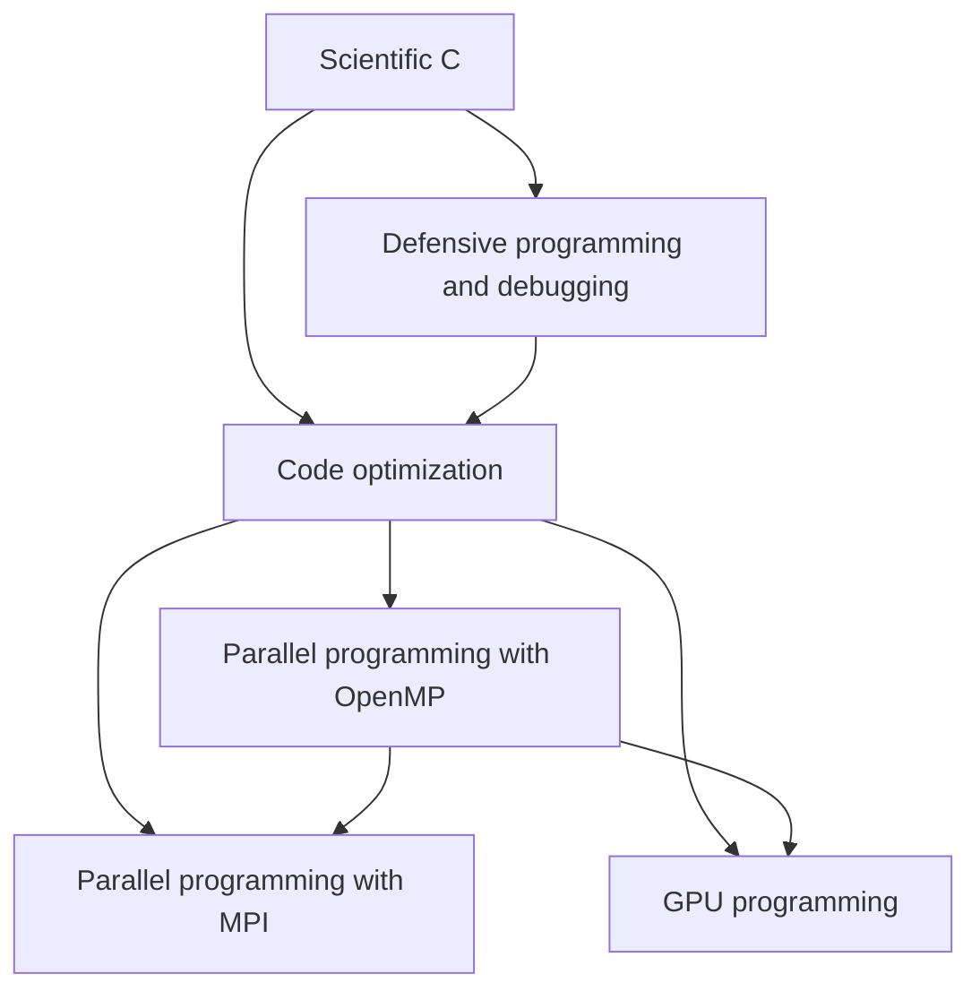

# C programming

C is still a very popular programming language, also in the
context of scientific programming and HPC.

```mermaid
graph TD
  Scientific_C[Scientific C] --> Defensive_programming_and_debugging[Defensive programming and debugging]
  Scientific_C --> Code_optimization[Code optimization]
  Defensive_programming_and_debugging --> Code_optimization
  Code_optimization --> Parallel_programming_with_OpenMP[Parallel programming with OpenMP]
  Code_optimization[Code optimization] --> Parallel_programming_with_MPI[Parallel programming with MPI]
  Parallel_programming_with_OpenMP --> Parallel_programming_with_MPI
  Code_optimization --> GPU_programming[GPU programming]
  Parallel_programming_with_OpenMP --> GPU_programming
  click Scientific_C "https://gjbex.github.io/Scientific-C/" "Scientific C"
  click Defensive_programming_and_debugging "https://gjbex.github.io/Defensive_programming_and_debugging/" "Defensive programming and debugging"
  click Code_optimization "https://gjbex.github.io/Code-optimization/" "Code optimization"
  click Parallel_programming_with_OpenMP "https://gjbex.github.io/Training-sessions/parallel_programming_with_openmp" "Parallel programming with OpenMP"
  click Parallel_programming_with_MPI "https://gjbex.github.io/Training-sessions/parallel_programming_with_mpi" "Parallel programming with MPI"
  click GPU_programming "https://gjbex.github.io/GPU-programming/" "GPU programming"
```
