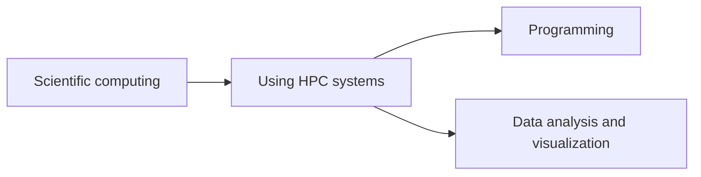

# Computational skills

```mermaid
graph LR
  Scientific_computing[Scientific computing] --> Using_HPC_systems[Using HPC systems]
  Using_HPC_systems --> Programming[Programming]
  Using_HPC_systems --> Data_analysis_and_visualization[Data analysis and visualization]
  click Scientific_computing "scientific_computing" "Scientific computing"
  click Using_HPC_systems "/using_hpc_systems" "Using HPC systems"
  click Programming "/programming" "Programming"
  click Data_analysis_and_visualization "/data_analysis_and_visualization" "Data analysis and visualization"
```
