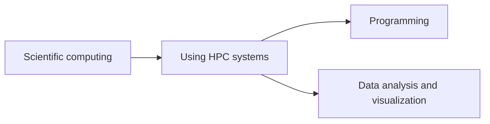

# Computational skills

```mermaid
graph LR
  Scientific_computing[Scientific computing] --> Using_HPC_systems[Using HPC systems]
  Using_HPC_systems --> Programming[Programming]
  Using_HPC_systems --> Data_analysis_and_visualization[Data analysis and visualization]
  click Scientific_computing "https://gjbex.github.io/Training-sessions/scientific_computing" "Scientific computing"
  click Using_HPC_systems "https://gjbex.github.io/Training-sessions/using_hpc_systems" "Using HPC systems"
  click Programming "https://gjbex.github.io/Training-sessions/programming" "Programming"
  click Data_analysis_and_visualization "https://gjbex.github.io/Training-sessions/data_analysis_and_visualization" "Data analysis and visualization"
```
