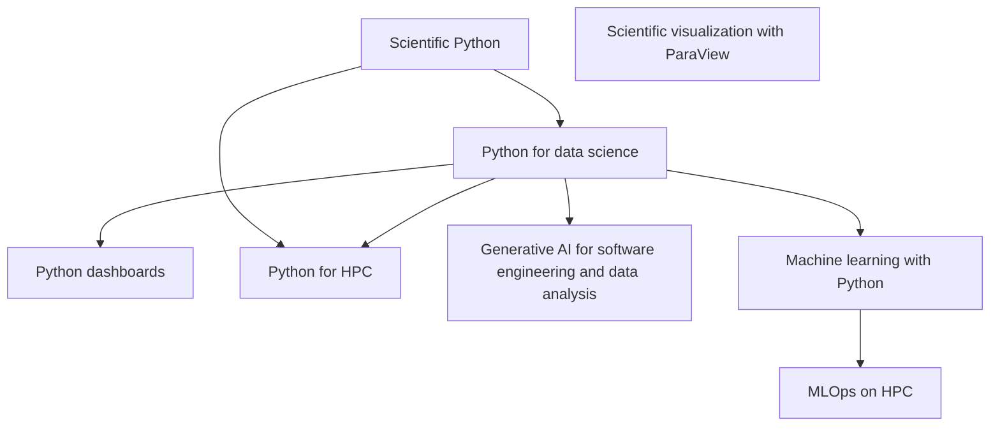

# Data analysis and visualization

Data analysis and visualization are essential skills for scientific computing.

```mermaid
graph TD
  Scientific_python[Scientific Python] --> Python_for_data_science[Python for data science]
  Python_for_data_science --> Python_dashboards[Python dashboards]
  Scientific_python --> Python_for_HPC[Python for HPC]
  Python_for_data_science --> Python_for_HPC
  Python_for_data_science --> Generative_ai_for_software_engineering_and_data_analysis[Generative AI for software engineering and data analysis]
  Python_for_data_science --> Machine_learning_with_Python[Machine learning with Python]
  Machine_learning_with_Python --> MLOps_on_HPC[MLOps on HPC]
  Scientific_visualization_with_ParaView[Scientific visualization with ParaView]
  click Scientific_python "https://gjbex.github.io/Scientific-Python/" "Scientific Python"
  click Generative_ai_for_software_engineering_and_data_analysis "https://gjbex.github.io/Training-sessions/generative_ai_for_software_engineering_and_data_analysis" "Generative AI for software engineering and data analysis"
  click Machine_learning_with_Python "https://gjbex.github.io/Training-sessions/machine_learning_with_python" "Machine learning with Python"
  click MLOps_on_HPC "https://gjbex.github.io/Training-sessions/mlops_on_hpc" "MLOps on HPC"
  click Scientific_visualization_with_ParaView "https://gjbex.github.io/Training-sessions/scientific_visualization_with_paraview" "Scientific visualization with ParaView"
  click Python_dashboards "https://gjbex.github.io/Python-dashboards/" "Python dashboards"
  click Python_for_HPC "https://gjbex.github.io/Python-for-HPC/" "Python for HPC"
  click Python_for_data_science "https://gjbex.github.io/Python-for-data-science/" "Python for data science"
```
