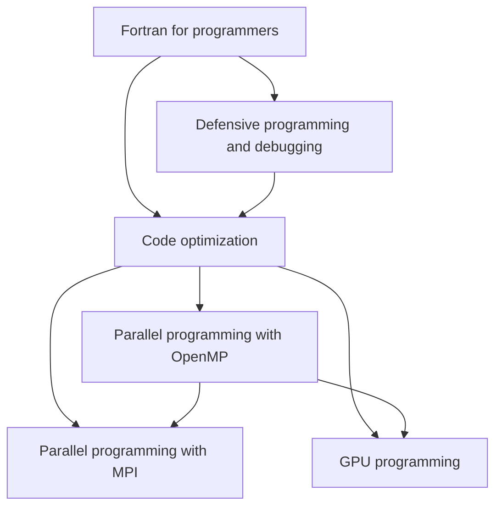

# Fortran prgramming

Fortran is still a very popular and important programming language in the
context of scientific programming and HPC.

```mermaid
graph TD
  Fortran_for_programmers[Fortran for programmers] --> Defensive_programming_and_debugging[Defensive programming and debugging]
  Fortran_for_programmers --> Code_optimization[Code optimization]
  Defensive_programming_and_debugging --> Code_optimization
  Code_optimization --> Parallel_programming_with_OpenMP[Parallel programming with OpenMP]
  Code_optimization[Code optimization] --> Parallel_programming_with_MPI[Parallel programming with MPI]
  Parallel_programming_with_OpenMP --> Parallel_programming_with_MPI
  Code_optimization --> GPU_programming[GPU programming]
  Parallel_programming_with_OpenMP --> GPU_programming
  click Fortran_for_programmers "https://gjbex.github.io/Fortran-for-programmers/" "Fortran for programmers"
  click Defensive_programming_and_debugging "https://gjbex.github.io/Defensive_programming_and_debugging/" "Defensive programming and debugging"
  click Code_optimization "https://gjbex.github.io/Code-optimization/https://gjbex.github.io/Code-optimization/" "Code optimization"
  click Parallel_programming_with_OpenMP "parallel_programming_with_openmp.md" "Parallel programming with OpenMP"
  click Parallel_programming_with_MPI "parallel_programming_with_mpi.md" "Parallel programming with MPI"
  click GPU_programming ""https://gjbex.github.io/GPU-programming/ "GPU programming"
```
