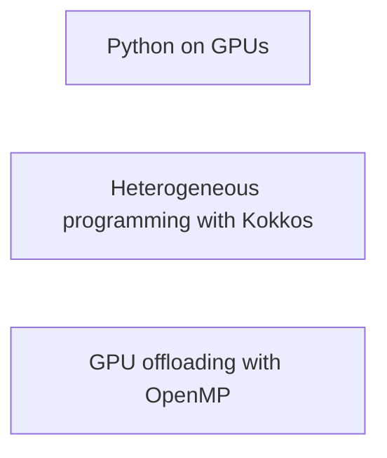

# GPU computing

GPUs are used more and more in scientific computing, data science and machine learning.

```mermaid
graph LR
    Python_on_GPUs[Python on GPUs]
    Heterogeneous_programming_with_Kokkos[Heterogeneous programming with Kokkos]
    GPU_offloading_with_OpenMP[GPU offloading with OpenMP]
    click Python_on_GPUs "https://gjbex.github.io/Python-on-GPUs/" "Python on GPUs"
    click Heterogeneous_programming_with_Kokkos "https://gjbex.github.io/GPU-programming/" "GPU programming"
    click GPU_offloading_with_OpenMP "https://gjbex.github.io/GPU-programming/" "GPU programming"
```
