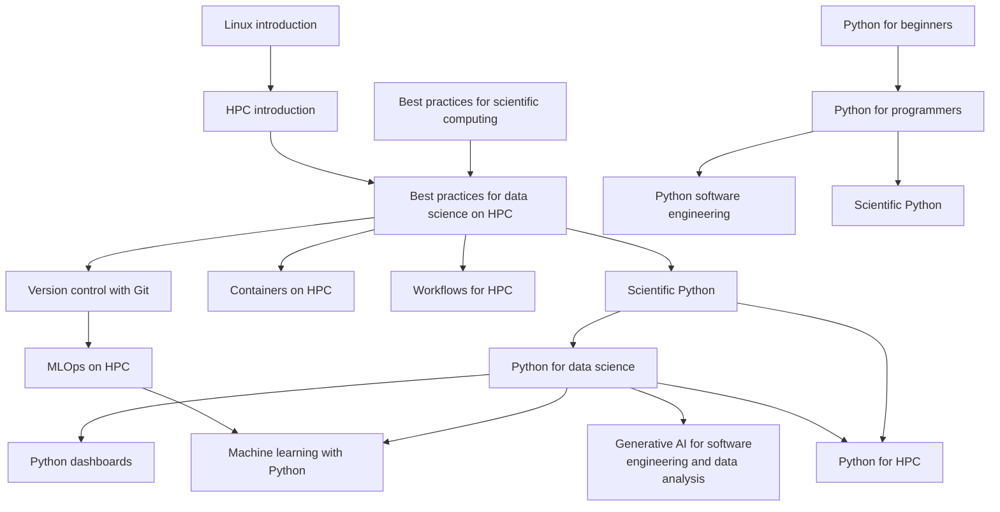

# Data science learning path

If you want to do data science on HPC, you can consider following the following training sessions.

```mermaid
graph TD
  Best_practices_for_scientific_computing[Best practices for scientific computing] --> Best_practices_for_data_science_on_HPC[Best practices for data science on HPC]
  Linux_intro[Linux introduction] --> HPC_intro[HPC introduction]
  HPC_intro --> Best_practices_for_data_science_on_HPC
  Best_practices_for_data_science_on_HPC --> Version_control_with_git[Version control with Git]
  Version_control_with_git --> MLOps_on_HPC[MLOps on HPC]
  Best_practices_for_data_science_on_HPC --> Containers_on_HPC[Containers on HPC]
  Best_practices_for_data_science_on_HPC --> Workflows_for_HPC[Workflows for HPC]
  Best_practices_for_data_science_on_HPC --> Scientific_python[Scientific Python]
  Python_for_beginners[Python for beginners] --> Python_for_programmers[Python for programmers]
  Python_for_programmers --> Python_software_engineering[Python software engineering]
  Python_for_programmers --> Scientific_Python[Scientific Python]
  Scientific_python --> Python_for_data_science[Python for data science]
  Python_for_data_science --> Python_dashboards[Python dashboards]
  Scientific_python --> Python_for_HPC[Python for HPC]
  Python_for_data_science --> Python_for_HPC
  Python_for_data_science --> Generative_ai_for_software_engineering_and_data_analysis[Generative AI for software\nengineering and data analysis]
  Python_for_data_science --> Machine_learning_with_Python[Machine learning with Python]
  MLOps_on_HPC --> Machine_learning_with_Python
  click Best_practices_for_scientific_computing "https://gjbex.github.io/Best-practices-for-scientific-computing/" "Best practices for scientific computing"
  click Best_practices_for_data_science_on_HPC "https://gjbex.github.io/Best-practices-for-data-science-on-HPC/" "Best practices for data science on HPC"
  click Linux_intro "https://gjbex.github.io/Training-sessions/linux_intro" "Linux introduction"
  click HPC_intro "https://gjbex.github.io/Training-sessions/hpc_intro" "HPC introduction"
  click Containers_on_HPC "https://gjbex.github.io/Containers-for-HPC/" "Containers on HPC"
  click Workflows_for_HPC "https://gjbex.github.io/Workflows-for-HPC/" "Workflows for HPC"
  click MLOps_on_HPC "https://gjbex.github.io/MLOps-on-HPC/" "MLOps on HPC"
  click Python_for_beginners "https://gjbex.github.io/Python-for-beginners/" "Python for beginners"
  click Python_for_programmers "https://gjbex.github.io/Python-for-programmers/" "Python for programmers"
  click Python_software_engineering "https://gjbex.github.io/Python-software-engineering/" "Python software engineering"
  click Scientific_python "https://gjbex.github.io/Scientific-Python/" "Scientific Python"
  click Generative_ai_for_software_engineering_and_data_analysis "https://gjbex.github.io/Training-sessions/generative_ai_for_software_engineering_and_data_analysis" "Generative AI for software engineering and data analysis"
  click Machine_learning_with_Python "https://gjbex.github.io/Training-sessions/machine_learning_with_python" "Machine learning with Python"
  click MLOps_on_HPC "https://gjbex.github.io/Training-sessions/mlops_on_hpc" "MLOps on HPC"
  click Python_dashboards "https://gjbex.github.io/Python-dashboards/" "Python dashboards"
  click Python_for_HPC "https://gjbex.github.io/Python-for-HPC/" "Python for HPC"
  click Python_for_data_science "https://gjbex.github.io/Python-for-data-science/" "Python for data science"
```
