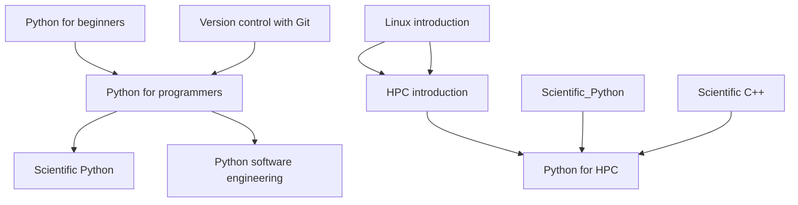

# HPC python application development learning path

If you want to develop HPC applications using Python, you can consider following the
following training sessions.

If you are new to development using Python, you may want to start with
"[Python for beginners](https://gjbex.github.io/Python-for-beginners)" and
"[Python for programmers](https://gjbex.github.io/Python-for-programmers)".

It is important that you improve you software engineering skills, so you may want to
follow the "[Python software engineering](https://gjbex.github.io/Python-software-engineering)" and
"[Version control with git](https://gjbex.github.io/Version-control-with-git)" training sessions.

Python has a rich ecosystem of libraries for scientific computing, so you may want to
follow the "[Scientific Python](https://gjbex.github.io/Scientific-Python)" training session.

Since you will be working on HPC systems, you need to be familiar with the
"[Linux introduction](https://gjbex.github.io/Training-sessions/linux_intro)" and
"[HPC introduction](https://gjbex.github.io/Training-sessions/hpc_intro)" training sessions.

Finally, you may want to follow the "[Python for HPC](https://gjbex.github.io/Python-for-HPC)"
training session to learn how to write efficient Python code for HPC systems.

If you intend to interface Python with C++ code, you may want to follow the
"[Scientific C++](https://gjbex.github.io/Scientific-C-plus-plus)" training session as well.
