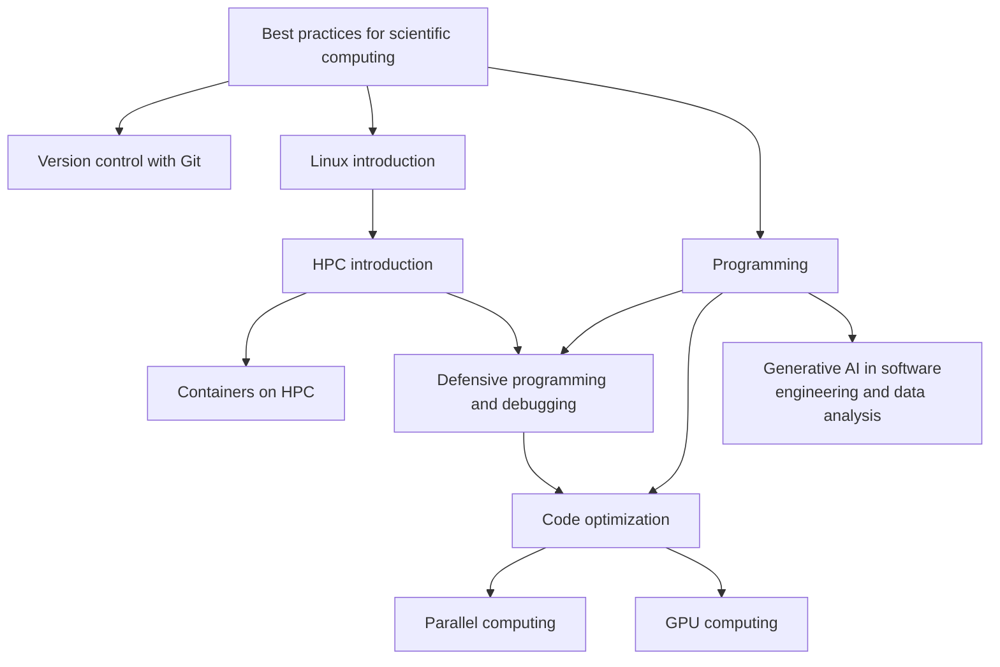

# HPC application development learning path

If you want to develop HPC applications, you can consider following the
following training sessions.

If you are new to software development in the context of scientific computing,
you may want to start with "[Best practices for scientific
computing](best_practices_for_scientific_computing.md)".

Of course, you coding skills should be up to par.  For more information on this
topic, see "[Programming](programming.md)".

Version control is an essential part of software engineering.  For more
information on this topic, see "[Version control with
git](https://gjbex.github.io/Version-control-with-git)".

[Containers](https://gjbex.github.io/Containers-for-HPC) are useful tools in
the context of software engineering both to create a complete, stable and
portable development environment, but also as a means to distribute your
software.

Writing robust code that has been well-tested is an essential part of software
development.  Having tests in place is also essential when trying to optimize
your code.  For more information on this topic, see "[Defensive programming and
debugging](https://gjbex.github.io/Defensive_programming_and_debugging)".

Effectively optimizing your code implies that you have a thorough understanding
of the hardware you are using and how your code interacts with it.  For more
information on this topic, see "[Code
optimization](https://gjbex.github.io/Code-optimization)".

Parallel or GPU computing is often required to take full advantage of modern
compute nodes.  For more information on this topic, see "[Parallel
computing](parallel_computing.md)" and "[GPU computing](gpu_computing.md)".
