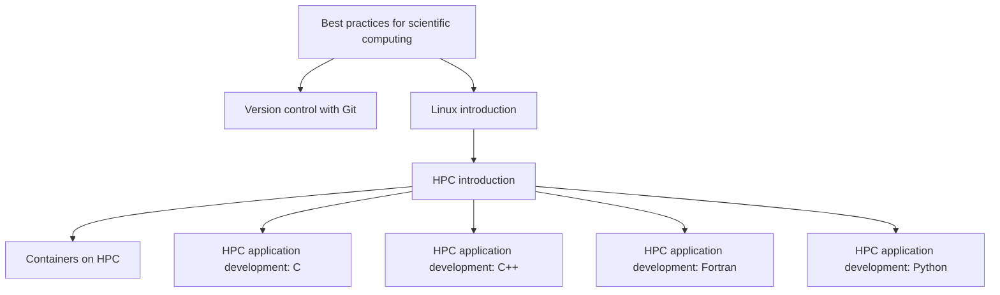

# HPC application development learning path

HPC application development is a broad topic.  The most useful path depends on
the programming language you use, but all paths share a common foundation.

```mermaid
graph TD
  Best_practices_for_scientific_computing[Best practices for scientific computing] --> Version_control_with_git[Version control with Git]
  Best_practices_for_scientific_computing --> Linux_intro[Linux introduction]
  Linux_intro --> HPC_intro[HPC introduction]
  HPC_intro --> Containers_on_HPC[Containers on HPC]
  HPC_intro --> C_path[HPC application development: C]
  HPC_intro --> Cpp_path[HPC application development: C++]
  HPC_intro --> Fortran_path[HPC application development: Fortran]
  HPC_intro --> Python_path[HPC application development: Python]
  click Best_practices_for_scientific_computing "https://gjbex.github.io/Best-practices-for-scientific-computing/" "Best practices for scientific computing"
  click Version_control_with_git "https://gjbex.github.io/Version-control-with-git" "Version control with Git"
  click Linux_intro "https://gjbex.github.io/Training-sessions/linux_intro" "Linux introduction"
  click HPC_intro "https://gjbex.github.io/Training-sessions/hpc_intro" "HPC introduction"
  click Containers_on_HPC "https://gjbex.github.io/Containers-for-HPC/" "Containers on HPC"
  click C_path "https://gjbex.github.io/Training-sessions/learning_path_hpc_application_development_c" "HPC application development: C"
  click Cpp_path "https://gjbex.github.io/Training-sessions/learning_path_hpc_application_development_cpp" "HPC application development: C++"
  click Fortran_path "https://gjbex.github.io/Training-sessions/learning_path_hpc_application_development_fortran" "HPC application development: Fortran"
  click Python_path "https://gjbex.github.io/Training-sessions/learning_path_hpc_application_development_python" "HPC application development: Python"
```

If you are new to software development in the context of scientific computing,
start with "[Best practices for scientific
computing](best_practices_for_scientific_computing.md)", "[Version control with
git](https://gjbex.github.io/Version-control-with-git)", and the basics of the
[Linux command line](https://gjbex.github.io/Training-sessions/linux_intro).

Since you will be developing for HPC systems, you should also be familiar with
the [HPC infrastructure](https://gjbex.github.io/Training-sessions/hpc_intro).
[Containers](https://gjbex.github.io/Containers-for-HPC) are useful for
creating portable software environments and distributing applications.

Choose the path that matches your main development language:

  * [HPC application development: C](learning_path_hpc_application_development_c.md)
  * [HPC application development: C++](learning_path_hpc_application_development_cpp.md)
  * [HPC application development: Fortran](learning_path_hpc_application_development_fortran.md)
  * [HPC application development: Python](learning_path_hpc_application_development_python.md)
