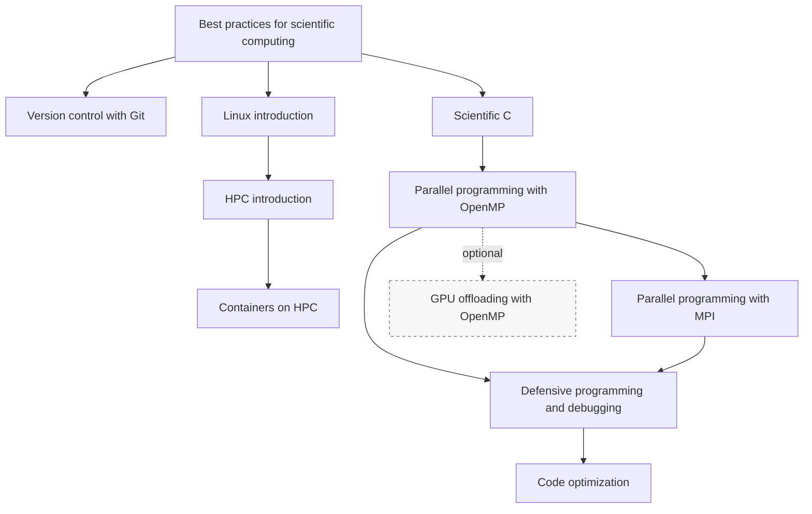

# HPC application development: C

If you want to develop HPC applications in C, you can consider following the
following training sessions.

Dashed arrows indicate optional branches.

Start with the shared scientific-computing, Linux and HPC foundations if these
are new to you.  Then follow "[Scientific C](https://gjbex.github.io/Scientific-C/)"
to strengthen your language skills for scientific programming.

After that, choose the parallel programming training that matches your target
hardware: "[Parallel programming with
OpenMP](parallel_programming_with_openmp.md)" for shared-memory nodes and
"[Parallel programming with MPI](parallel_programming_with_mpi.md)" for
distributed-memory systems.

For production-quality parallel C applications, continue with "[Defensive
programming and debugging](https://gjbex.github.io/Defensive-programming-and-debugging/)"
to learn how to test and debug shared-memory and MPI applications.

"[GPU offloading with OpenMP](https://gjbex.github.io/GPU-programming/)" is an
optional branch when accelerators are part of your target system.

"[Code optimization](https://gjbex.github.io/Code-optimization/)" is most useful
after you have a correct CPU implementation, know which programming model you
will use, and have the debugging skills to validate changes.
