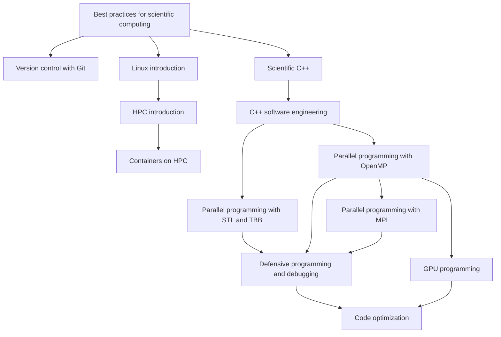

# HPC application development: C++

If you want to develop HPC applications in C++, you can consider following the
following training sessions.

Start with the shared scientific-computing, Linux and HPC foundations if these
are new to you.  Then follow "[Scientific
C++](https://gjbex.github.io/Scientific-C-plus-plus/)" and "[C++ software
engineering](https://gjbex.github.io/C-plus-plus-software-engineering/)" to
build a maintainable application or library.

For parallelism, choose "[Parallel programming with STL and
TBB](parallel_programming_with_stl_and_tbb.md)" for modern C++ shared-memory
patterns, "[Parallel programming with OpenMP](parallel_programming_with_openmp.md)"
for directive-based shared-memory programming, and "[Parallel programming with
MPI](parallel_programming_with_mpi.md)" for distributed-memory systems.

For robust parallel development, continue with "[Defensive programming and
debugging](https://gjbex.github.io/Defensive-programming-and-debugging/)" to
learn how to test and debug shared-memory and MPI applications.

"[GPU programming](https://gjbex.github.io/GPU-programming/)" is an optional
branch when accelerators are part of your target system.  "[Code
optimization](https://gjbex.github.io/Code-optimization/)" is most useful after
you have a correct implementation, know which programming model you will use,
and have the debugging skills to validate changes.
