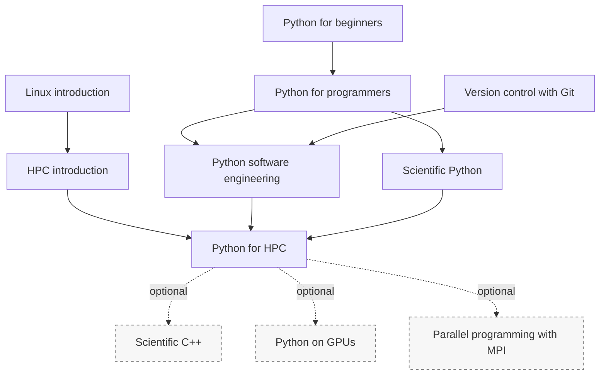

# HPC application development: Python

If you want to develop HPC applications using Python, you can consider following the
following training sessions.

Dashed arrows indicate optional branches.

If you are new to programming, start with "[Python for
beginners](https://gjbex.github.io/Python-for-beginners)" to learn the basics.
This is a preparatory training session.  To reach the level needed for the rest
of this path, continue with "[Python for
programmers](https://gjbex.github.io/Python-for-programmers)", which goes into
more detail and is the real starting point for HPC Python development.  If you
already have programming experience in another language, you can start directly
with "[Python for programmers](https://gjbex.github.io/Python-for-programmers)".

Since you will be working on HPC systems, you should be familiar with the
"[Linux introduction](https://gjbex.github.io/Training-sessions/linux_intro)"
and "[HPC introduction](https://gjbex.github.io/Training-sessions/hpc_intro)"
training sessions.

For scientific applications, continue with "[Scientific
Python](https://gjbex.github.io/Scientific-Python)" to learn the core Python
libraries used for numerical and scientific computing.

For maintainable HPC Python applications, follow "[Version control with
git](https://gjbex.github.io/Version-control-with-git)" and "[Python software
engineering](https://gjbex.github.io/Python-software-engineering)".  These
topics become important once your code needs to be shared, installed, tested,
documented, or reused.

"[Python for HPC](https://gjbex.github.io/Python-for-HPC)" is the central
training in this path.  It focuses on writing efficient Python code for HPC
systems and on understanding when Python code should use optimized libraries,
parallel execution, or compiled extensions.

If you intend to interface Python with C++ code, you may want to follow
"[Scientific C++](https://gjbex.github.io/Scientific-C-plus-plus)" as an
optional branch.

If you want to use accelerators from Python, follow "[Python on
GPUs](https://gjbex.github.io/Python-on-GPUs/)".  If your Python application
uses distributed-memory parallelism, follow "[Parallel programming with
MPI](parallel_programming_with_mpi.md)".
