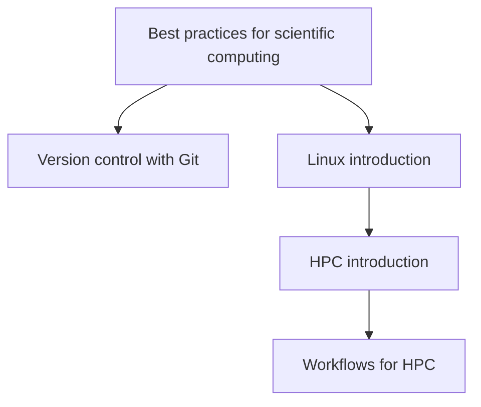

# HPC application development learning path

If you want to run HPC applications, you can consider following the
following training sessions.

If you are new to running HPC applications in the context of scientific
computing, you may want to start with "[Best practices for scientific
computing](best_practices_for_scientific_computing.md)".

The next step is to fammliarize yourself with the basics of working on the
[Linux command line](https://gjbex.github.io/Training-sessions/linux_intro) and
the [HPC infrastructure](https://gjbex.github.io/Training-sessions/hpc_intro).

Version control is an essential part of reproducible scientific research.  For
more information on this topic, see "[Version control with
git](https://gjbex.github.io/Version-control-with-git)".

Depending on the HPC application you want to run, you may want to learn
about "[Workflows for
HPC](https://gjbex.github.io/Workflows-for-HPC/)".
