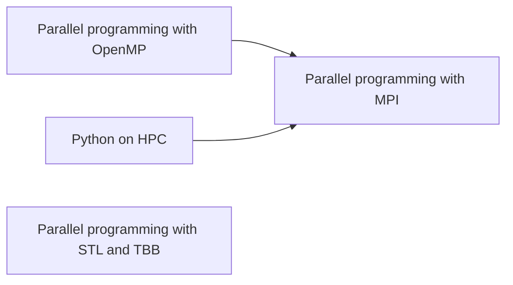

# Parallel computing

Parallel computing will help to exploit the full potential of modern hardware
in general and HPC systems in particular.

```mermaid
graph LR
  Parallel_programming_with_OpenMP[Parallel programming with OpenMP] --> Parallel_programming_with_MPI[Parallel programming with MPI]
  Python_on_HPC[Python on HPC] --> Parallel_programming_with_MPI
  Parallel_programming_with_STL_and_TBB[Parallel programming with STL and TBB]
  click Parallel_programming_with_OpenMP "parallel_programming_with_openmp.md" "Parallel programming with OpenMP"
  click Parallel_programming_with_MPI "parallel_programming_with_mpi.md" "Parallel programming with MPI"
  click Python_on_HPC "https://gjbex.github.io/Python-on-HPC/" "Python on HPC"
  click Parallel_programming_with_STL_and_TBB "parallel_programming_with_stl_and_tbb.md" "Parallel programming with STL and TBB"
```
