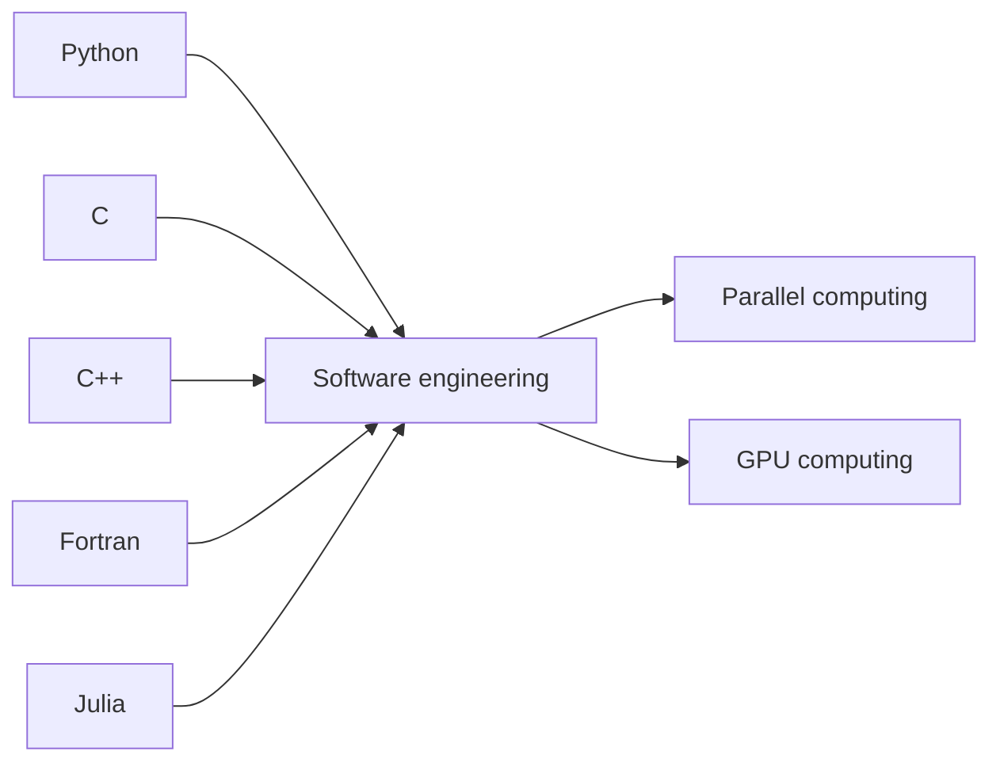

# Programming

```mermaid
graph LR
  Python[Python] --> Software_engineering[Software engineering]
  C[C] --> Software_engineering
  Cpp[C++] --> Software_engineering
  Fortran[Fortran] --> Software_engineering
  Julia[Julia] --> Software_engineering
  Software_engineering --> Parallel_computing[Parallel computing]
  Software_engineering --> GPU_computing[GPU computing]
  click Python "/python" "Python"
  click C "/c" "C"
  click Cpp "/cpp" "C++"
  click Fortran "/fortran" "Fortran"
  click Julia "https://gjbex.github.io/Julia_good_bad_ugly/" "Julia"
  click Software_engineering "/software_engineering" "Software engineering"
  click Parallel_computing "/parallel_computing" "Parallel computing"
  click GPU_computing "/gpu_computing" "GPU computing"
```
