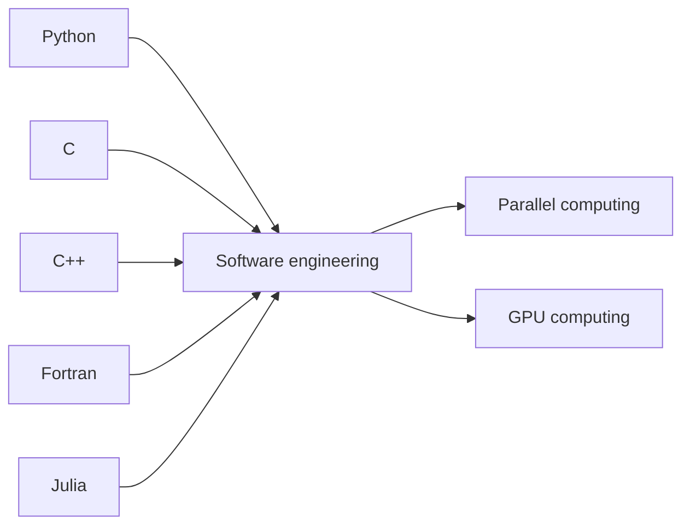

# Programming

```mermaid
graph LR
  Python[Python] --> Software_engineering[Software engineering]
  C[C] --> Software_engineering
  Cpp[C++] --> Software_engineering
  Fortran[Fortran] --> Software_engineering
  Julia[Julia] --> Software_engineering
  Software_engineering --> Parallel_computing[Parallel computing]
  Software_engineering --> GPU_computing[GPU computing]
  click Python "python.md" "Python"
  click C "c.md" "C"
  click Cpp "cpp.md" "C++"
  click Fortran "fortran.md" "Fortran"
  click Julia "https://gjbex.github.io/Julia_good_bad_ugly/" "Julia"
  click Software_engineering "software_engineering.md" "Software engineering"
  click Parallel_computing "parallel_computing.md" "Parallel computing"
  click GPU_computing "gpu_computing.md" "GPU computing"
```
