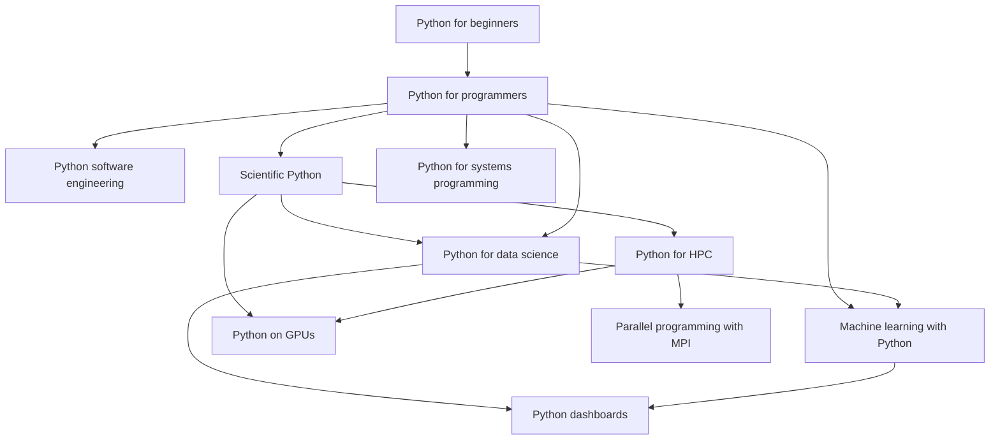

# Python programming

Python is a versatile programming language that is used in many domains.

```mermaid
graph TD
  Python_for_beginners[Python for beginners] --> Python_for_programmers[Python for programmers]
  Python_for_programmers --> Python_software_engineering[Python software engineering]
  Python_for_programmers --> Scientific_Python[Scientific Python]
  Scientific_Python --> Python_for_data_science[Python for data science]
  Python_for_programmers --> Python_for_data_science
  Python_for_programmers --> Machine_learning_with_Python[Machine learning with Python]
  Python_for_data_science --> Machine_learning_with_Python
  Python_for_data_science --> Python_dashboards[Python dashboards]
  Machine_learning_with_Python --> Python_dashboards
  Scientific_Python --> Python_for_HPC[Python for HPC]
  Scientific_Python --> Python_on_GPUs[Python on GPUs]
  Python_for_HPC --> Python_on_GPUs
  Python_for_HPC --> Parallel_programming_with_MPI[Parallel programming with MPI]
  Python_for_programmers --> Python_for_systems_programming[Python for systems programming]
  click Python_for_beginners "https://gjbex.github.io/Python-for-beginners/" "Python for beginners"
  click Python_for_programmers "https://gjbex.github.io/Python-for-programmers/" "Python for programmers"
  click Python_software_engineering "https://gjbex.github.io/Python-software-engineering/" "Python software engineering"
  click Scientific_Python "https://gjbex.github.io/Scientific-Python/" "Scientific Python"
  click Python_for_data_science "https://gjbex.github.io/Python-for-data-science/" "Python for data science"
  click Machine_learning_with_Python "https://gjbex.github.io/Machine-learning-with-Python/" "Machine learning with Python"
  click Python_dashboards "https://gjbex.github.io/Python-dashboards/" "Python dashboards"
  click Python_for_HPC "https://gjbex.github.io/Python-for-HPC/" "Python for HPC"
  click Python_on_GPUs "https://gjbex.github.io/Python-on-GPUs/" "Python on GPUs"
  click Parallel_programming_with_MPI "https://gjbex.github.io/Training-sessions/parallel_programming_with_mpi" "Parallel programming with MPI"
  click Python_for_systems_programming "https://gjbex.github.io/Python-for-systems-programming/" "Python for systems programming"
```
