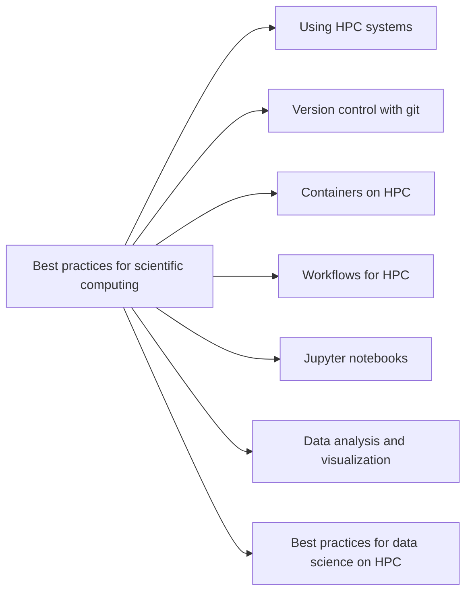

# Scientific computing

Scientific computing is a broad field that encompasses many different aspects of
computing.  It is the application of computer algorithms to solve scientific
problems.  This can range from simple data analysis to complex simulations.

However, it also requires a certain mindset and knowledge of best practices to
ensure that the results are reliable and reproducible.  This includes knowledge
of [version control](https://gjbex.github.io/Version-control-with-git),
software design, testing, and documentation.  For more information on this
topic, see "[Best practices for scientific
computing](best_practices_for_scientific_computing.md)".
