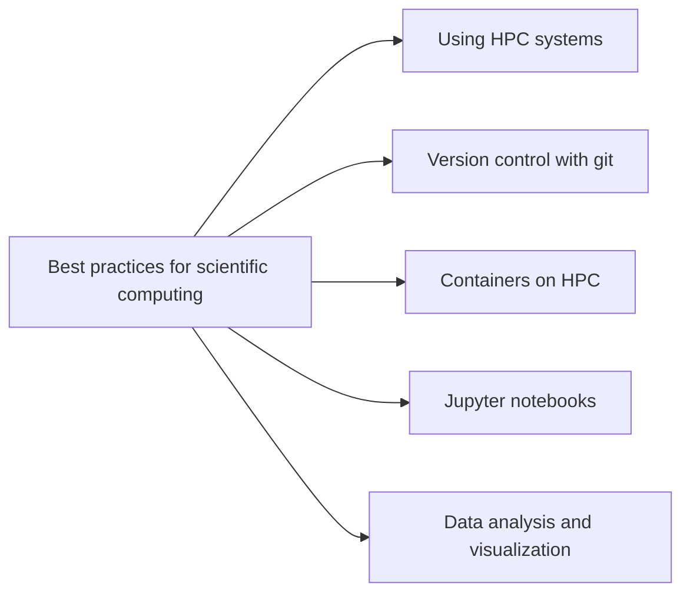

# Scientific computing

```mermaid
graph LR
   Best_practices_for_scientific_computing[Best practices for scientific computing] --> Using_HPC_systems[Using HPC systems]
   Best_practices_for_scientific_computing --> Version_control_with_git[Version control with git]
   Best_practices_for_scientific_computing --> Containers_on_HPC[Containers on HPC]
   Best_practices_for_scientific_computing --> Jupyter_notebooks[Jupyter notebooks]
   Best_practices_for_scientific_computing --> Data_analysis_and_visualization[Data analysis and visualization]
   click Best_practices_for_scientific_computing "/best_practices_for_scientific_computing" "Best practices for scientific computing"
   click Using_HPC_systems "/using_hpc_systems" "Using HPC systems"
   click Version_control_with_git "https://gjbex.github.io/Version-control-with-git/" "Version control with git"
   click Containers_on_HPC "https://gjbex.github.io/Containers-for-HPC/" "Containers on HPC"
   click Jupyter_notebooks "/jupyter_notebooks" "Jupyter notebooks"
   click Data_analysis_and_visualization "/data_analysis_and_visualization" "Data analysis and visualization"
```
