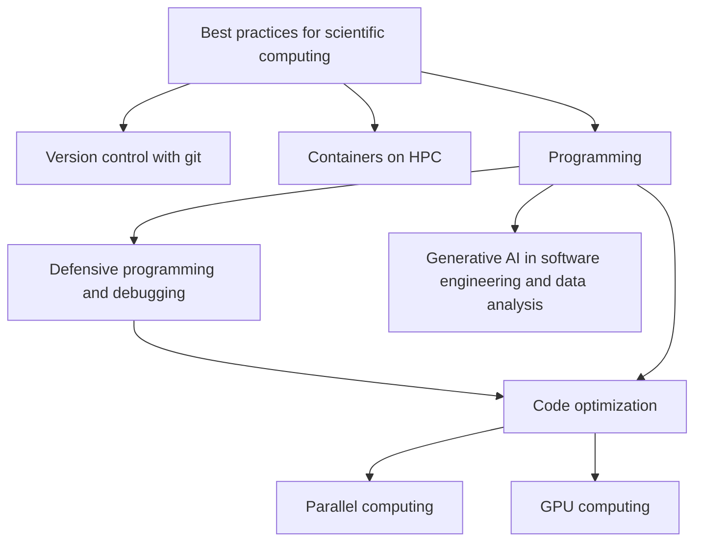

# Software engineering

Good practices in software engineering will contribute considerably to the
quality of your scientific software.

```mermaid
graph TD
  Best_practices_for_scientific_computing[Best practices for scientific computing] --> Version_control_with_git[Version control with git]
  Best_practices_for_scientific_computing --> Containers_on_HPC[Containers on HPC]
  Best_practices_for_scientific_computing --> Programming[Programming]
  Programming --> Defensive_programming_and_debugging[Defensive programming and debugging]
  Defensive_programming_and_debugging --> Code_optimization[Code optimization]
  Programming --> Code_optimization
  Programming --> Generative_AI_in_software_engineering_and_data_analysis[Generative AI in software engineering and data analysis]
  Code_optimization --> Parallel_computing[Parallel computing]
  Code_optimization --> GPU_computing[GPU computing]
  click Best_practices_for_scientific_computing "/best_practices_for_scientific_computing" "Best practices for scientific computing"
  click Version_control_with_git "https://gjbex.github.io/Version-control-with-git/" "Version control with git"
  click Containers_on_HPC "https://gjbex.github.io/Containers-for-HPC/" "Containers on HPC"
  click Programming "/programming" "Programming"
  click Defensive_programming_and_debugging "https://gjbex.github.io/Defensive_programming_and_debugging/" "Defensive programming and debugging"
  click Code_optimization "https://gjbex.github.io/Code-optimization/https://gjbex.github.io/Code-optimization/" "Code optimization"
  click Parallel_computing "/parallel_computing" "Parallel computing"
  click GPU_computing "/gpu_computing" "GPU computing"
  click Generative_AI_in_software_engineering_and_data_analysis "/generative_ai_in_software_engineering_and_data_analysis" "Generative AI in software engineering and data analysis"
```
