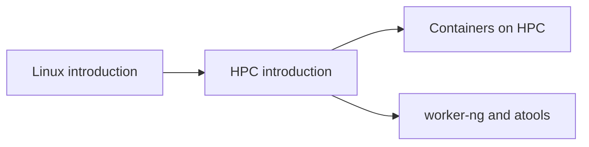

# Using HPC systems

```mermaid
graph LR
    Linux_intro[Linux introduction] --> HPC_intro[HPC introduction]
    HPC_intro --> Containers_on_HPC[Containers on HPC]
    HPC_intro --> Worker_ng_and_atools[worker-ng and atools]
    click Linux_intro "linux_intro.md" "Linux introduction"
    click HPC_intro "hpc_intro.md" "HPC introduction"
    click Containers_on_HPC "https://gjbex.github.io/Containers-for-HPC/" "Containers on HPC"
    click Worker_ng_and_atools "https://gjbex.github.io/worker-and-atools/" "Worker nodes and atools"
```
