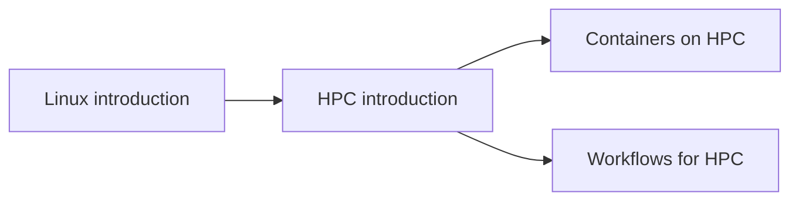

# Using HPC systems

```mermaid
graph LR
    Linux_intro[Linux introduction] --> HPC_intro[HPC introduction]
    HPC_intro --> Containers_on_HPC[Containers on HPC]
    HPC_intro --> Workflows_for_HPC[Workflows for HPC]
    click Linux_intro "https://gjbex.github.io/Training-sessions/linux_intro" "Linux introduction"
    click HPC_intro "https://gjbex.github.io/Training-sessions/hpc_intro" "HPC introduction"
    click Containers_on_HPC "https://gjbex.github.io/Containers-for-HPC/" "Containers on HPC"
    click Workflows_for_HPC "https://gjbex.github.io/Workflows-for-HPC/" "Workflows for HPC"
```
