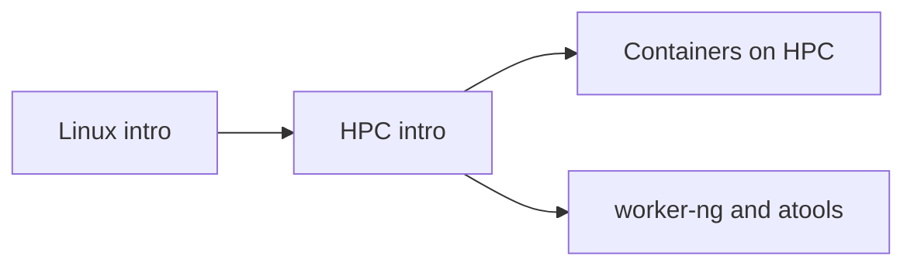

# Using HPC systems

```mermaid
graph LR
  Linux_intro[Linux intro] --> HPC_intro[HPC intro]
  HPC_intro --> Containers_on_HPC[Containers on HPC]
  HPC_intro --> worker_ng_and_atools[worker-ng and atools]
```
